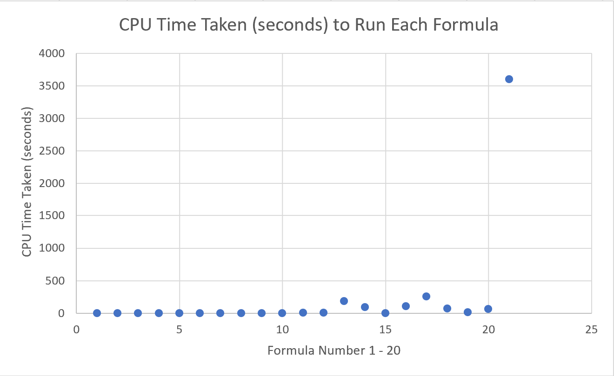
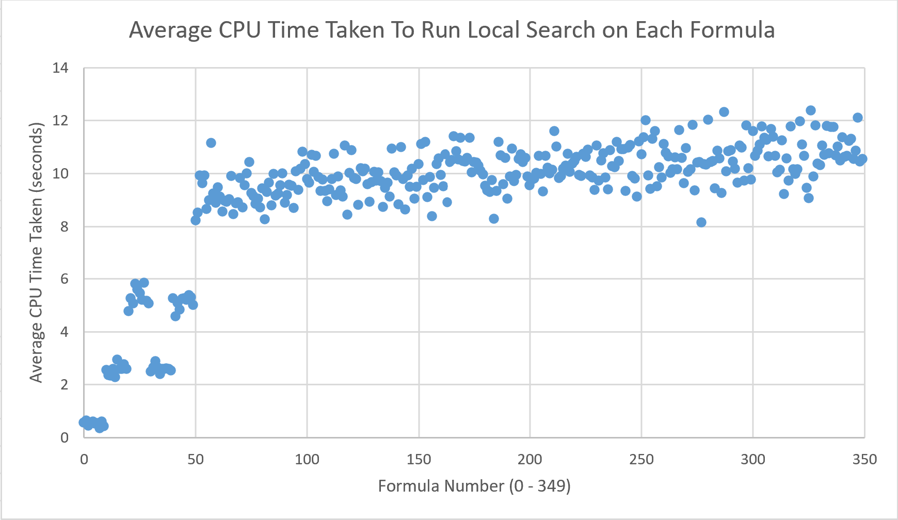
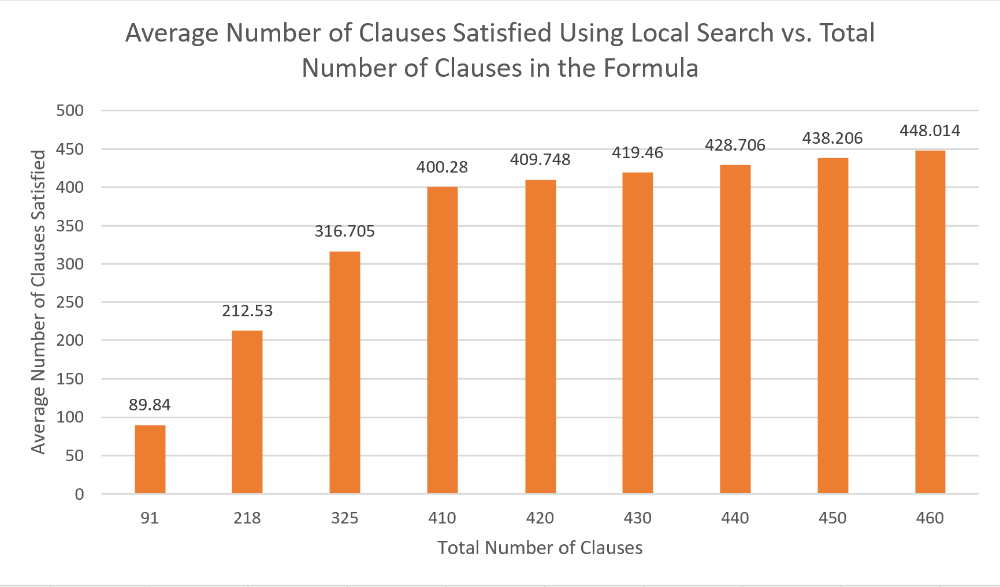
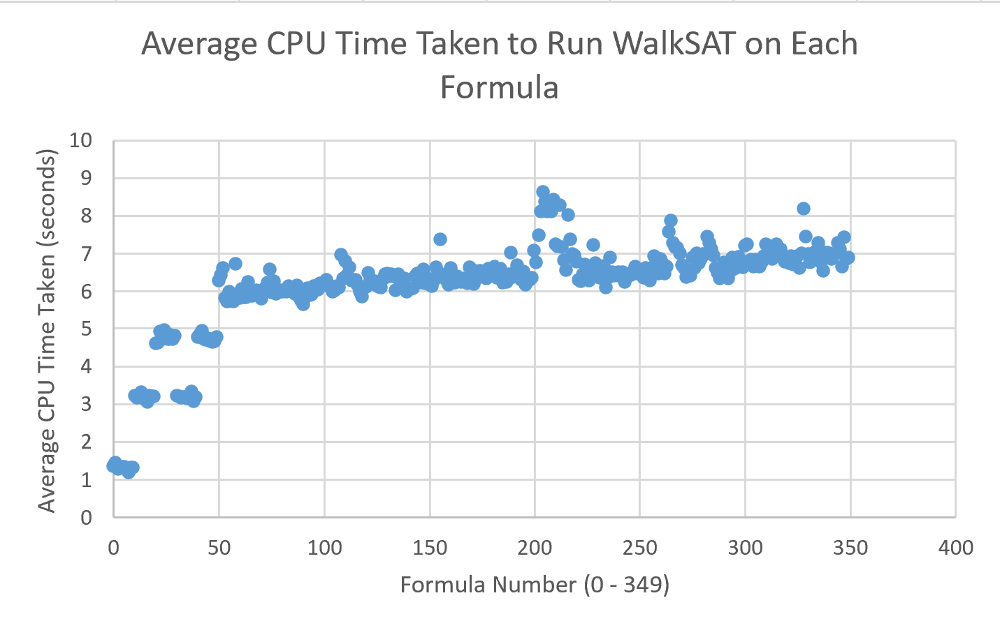
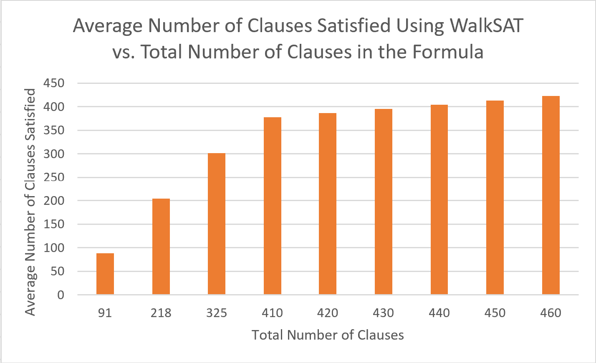

# Program 3: SAT Algorithms

## Table of Contents

[How to run the code](#how-to-run-the-code)

[DPLL Algorithm Description](#dpll-algorithm-description)

[Local Search Algorithm Description](#local-search-algorithm-description)

[WalkSAT Algorithm Description](#walksat-algorithm-description)

[Graphs](#graphs)

[Learning Outcomes](#learning-outcomes)

[Who-Did-What](#who-did-what)

## How to run the code

To compile the program

```
g++ SATassignment.cpp -o SAT
```

To then run the program

```
./SAT
```

## DPLL Algorithm Description

The DPLL algorithm is implemented in the file dpll.h, specifically through the function dpll.solve(file). Where file is the file containing the formula you would like to solve. First solve() will run setup which will oprganize the data to be parsable to use in the recursiveDPLL function. This setup is mostly just putting file data into vectors and set the frequency each variable appears and the polarity (appear more pos or neg). After the data is intialized we call recursiveDPLL(formula, eq.numClauses) where we pass the intial formula and the total num of clauses in the file. INside this function we call unitPropagate(formula). This will 'solve' a formula by looking at multiple thing including if it is a unit clause etc. If the clause is not empty applyValue() will be called. This function applys T or F choice to all variables as the one passed to it. IT will then also check and branch according with if a clause cannot be solved with the applied variable. This will set a flag and pass it to recursiveDPLL() where we recurse and continue with other variables. We ran into some trouble when testing the DPLL function. The problem is when we get to a high number of clauses within a file specifically the files that contain 325 files or more, the runtuime becomes unresonable especially when it was still running after 3 hrs. According to our data DPLL will work with enough time, but our branching heauristic seems to be unrefined causing the delay. 

## Local Search Algorithm Description

The local search algorithm is implemented in the file localSearch.h, specifically through the function solveUsingLocalSearch() which is present in this file. This function takes in an equation struct as input, and returns a string with either the satisfying assignment or the highest number of clauses able to be satisfied. The equation struct that is inputted includes an int for the number of variables in the equation, and in for the number of clauses in the equation, and a 2D vector of ints storing all of the literals in each clause for the whole equation. The algorithm starts by getting a random assignment for all of the variables, stored in a string a. The string a's length is equal to the number of variables present in the equation, and consists of randomly generated 0's and 1's, with 1 representing a positive literal and 0 representing a negative literal. The fitness (number of satisfied clauses) of this assignment is found and assigned to the highestFitness value. The fitness function is represented within the function fitness(), which takes in an equation and an a assignment, and returns a struct with an int representing the number of satisfied clauses and a vector of bools representing which of the clauses were satisfied. This function goes through each of the literals in each of the clauses in the formula and checks if that literal is present in the assignment passed in. The algorithm then enters a loop that is only broken out of when a certain number of iterations has been reached or a satisfying assignment has been found, whichever comes first. The number of iterations performed, designated in the int value maxIterations, was a design decision that had to be made. In order for the algorithm to run fast enough to reasonably be able to run it on 350 Boolean formulas 10 times, my code was only able to handle 1000 iterations. Ideally, this number would be higher in order to solve more of the equations, however this was not possible for me for this assignment. Each iteration consists of checking each of the a value's neighbors and seeing if any of them satisfy more clauses than the current a assignment. The assignment's neighbors consist of assignments that are one hamming distance away from the current assignment (one character has been flipped from 0 to 1 or 1 to 0). As soon as the algorithm finds a new assignment that has a better fitness than the current assignment, it stops checking the current assignment's neighbors and sets the current assignment to the new assignment. If the new assignment satisfies the formula, the algorithm breaks out of the loop and returns this satisfying assignment. If not, this new assignment's neighbors are then checked and the process repeats. If at any point an assignment has no neighbors whose fitness is better than theirs, but does not satisfy the equation (a local maximum has been reached), a new a assignment is randomly generated again and another iteration is performed.

## WalkSAT Algorithm Description

The WalkSAT algorithm is very similar to the local search algorithm, but has some key differences in its implementation. This algorithm is implemented within the solveUsingWalkSAT() function within the WalkSAT.h file in this project. Same as local search, this function takes in an equation struct as input and returns a string of either the satisfying assignment or of the highest fitness acheived. This algorithm again starts by randomly generating an a assignment, calculating the fitness of that assignment, and assigning that value to the highestFitness variable. If this assignment satisfies the formula, the algorithm is over and that satisfying assignment is returned. If not, an unsatisfied clause C from the equation is randomly chosen. The algorithm then utilizes a probability p variable that was predefined at the top of the function. Choosing this variable was a decign decision for this algorith, which I will explain once I describe what the probability determines. With probability p, a random literal within C is chosen and flipped. With probability 1-p, a literal within C that minimizes the number of clauses that go from true to false is chosen and flipped. When more than one literal in C causes the same number of clauses to go from true to false, the first one that was found is chosen. This was a design decision I made based simply on ease of implementation within the code. When the probability of the second option was higher, the algorithm tended to solve more equations, but it also ran much slower. The opposite was true when the probability of the first option was higher. Therefore, I decided to go with a probability of 0.5 to maximize the function's performance while also making sure its run-time was fast enough to be run so many times. Once a literal in the unsatisfied clause C is flipped, one flip iteration has been performed and the algorithm repeats the process of finding a random unsatisfied clause C and flipping one of its literals over and over again for a predetermined number of flips (unless a satisfying assignment is found first). I decided to set the maxFlips variable (which determines the number of times this part of the algorithm is repeated) to be 12. Having more flips per algorithm iteration led to more equations being solved, but also meant the algorithm was much slower if the equation was never solved. Therefore, I settled on 12 being a good number. Once 12 flips are performed (or a satisfying equation is found), another random a assignment is generated and the whole algorithm repeats itself over and over again for a certain number of iterations. This algorithm ran significantly faster than local search, so I was able to run more iterations. I chose 1000 iterations for this variable. This value combined with the 12 flips per iteration led to the most equations being solved while still running quickly enough to perform on 350 formulas 10 times.

## Graphs

Data for each of the below graphs is available in separate excel files for each algorithm.

### DPLL



As can be seen in this graph, not all of the 350 formulas were able to be tested with the DPLL algorithm written. This is not due to DPLL not working. It is due to our branching heuristic in DPLL. This causes DPLL to take a very long time to run, but would eventually come to a conclusion. Running all of the 350 equations therefore would have taken too long to complete before the deadline for this assignment. For formulas 1 through 19, the formulas with the same number of clauses, they took relatively the same amount of time to run.

### Local Search

For local search, I ran the algorithm on each of the 350 formulas 10 times and collected the data in separate excel files. For ease of access, I combined all 10 separate files into one excel file, with each run's data on its own sheet within the file. I then created an "Averages" sheet to average all of the values from each of the 10 runs. From this data, I created a graph showing the average CPU time taken to run the algorithm on each of the formulas. This graph can be seen below:



As can be seen within this graph, the amount of CPU time needed to run the algorithm depends greatly on the formula it was run on. This is because as the number of the formula increases, the number of clauses present in the formula increases greatly as well. The more clauses needed to be satisfied means the more time the algorithm will take to run.

Also within the "Averages" sheet, I found the average number of clauses satisfied per number of clauses present for the formulas with the same number of clauses. The graph for this data can be seen below:



As can be seen in this graph, the algorithm when run with the amount of iterations I was able to run it with does not solve the majority of the formulas. It does get rather close, however. As the number of clauses increases, the percentage of those clauses that are able to be solved decreases slightly. If this algorithm was able to be run with more iterations, the percentage of clauses that were able to be satisfied by the algorithm would increase tremendously.

### WalkSAT

For WalkSAT, I also ran the algorithm on each of the 350 formulas 10 times and collected the data in separate excel files, which were then combined into one excel file. I also created an "Averages" sheet in this combined excel file. I used the same process as I had done for local search. From this data, I created a graph to show the average CPU time taken to run the algorithm on each of the formulas, which can be seen below:



As can be seen in this graph, WalkSAT was overall slightly faster than local search, although creating a similar shape on the graph. The CPU time taken increased as the number of clauses in the formulas increased as well, which is to be expected. Also, the amount of time taken to run the algorithm on equations with the same number of clauses was pretty consistent. 

I also found the average number of clauses satisfied per number of clauses present for the formulas with the same number of clauses for this data. The graph for this can be seen below:



As can be seen in this graph, the average amount of clauses satisfied compared to the number of total clauses decreases as the number of total clauses increases, same as with local search. Although I was able to do more iterations with WalkSAT, it still did not solve the majority of the equations. I believe being able to perform even more iterations would increase the number of formulas able to be solved by quite a bit. 

## Learning Outcomes

I learned quite a bit from this assignment, mainly about the different versions of satisfiability algorithms. I had never heard about any of them before this class and project, so learning about them in class and through implementing a couple in this program was a good learning experience for me. I also was able to learn a little bit about how important and highly studied / researched of a topic in CS and AI the SAT algorithms are. Every time I would google an algorithm to look for pseudocode, lots of scholarly articles about the algorithms and how to implement them the most efficiently would come up. There has been a lot of research done on this topic, and there is still not a perfect answer.

Second, I also learned that making decisions within the algorithms, in my case in local search and WalkSAT, can change a lot about how the algorithm functions and runs. Choosing the number of iterations for each of these algorithms was the decision that affected their performance the most. By performing more iterations, the liklihood of finding a solution through these algorithms was much greater, but it also slowed them down significantly. Also, choosing the value for the probability in the WalkSAT algorithm had a pretty significant impact on the algorithm's performance. Choosing a literal in the unsatisfied clause C that was guaranteed to turn the smallest number of clauses from true to false tended to be more beneficial than choosing a random literal, but determining which of the literals did this took quite a bit of time. So, there were drawbacks and benefits presented with each design decision I needed to make when implementing the algorithms.

Finally, the biggest thing I would say I learned is that these algorithms are slow. I spent quite a bit of time trying to change their implementation to be faster, but I was not able to get them quite as fast as I would have liked. When I first implemented the algorithms, I used C++'s built in random number generator, rand(). Since this function was called several times throughout each iteration of each algorithm, my first idea to speed them up was to look into a faster and more effective random number generator. I found one online (it is cited in the code), that was very easy to implement, did a better job at actually picking random numbers, and ran much more quickly. So, I implemented this in the algorithms. It did cause them to run slightly more quickly, so I left the implementation in there, but it did not improve their run times very much. I asked Dr. Goldsmith for help on how to make the algorithms faster, and she suggested using a different data structure to store the information for each formula. The data structure she proposed was an array consisting of each literal, with each having pointers to every clause they are present in. I implemented this data structure, and it did not end up improving my run times by much, and I was getting slightly more inconsistent results when running the algorithms. Because of this and my lack of time to be able to keep retrying to implement it, I stuck with my original algorithm design and just performed slighlty less iterations. I did determine that running the code in a command prompt as opposed to in visual studio allowed it to run significantly more quickly, so I was able to get at least 1000 iterations of each algorithm. Each time I ran the local search algorithm on all 350 equations still took my computer about 50 minutes, so testing 10 times took a little over 8 hours of consistently running the program, with similar times for the WalkSAT algorithm as well.

## Who-Did-What

My programming partner, Jacob Morris, and I communicated very well on this project, and we decided to split up the work equally. He determined that he wanted to tackle DPLL, and I decided I would work on local search. Once I had implemented local search, I determined that WalkSAT was very similar, and therefore decided to implement that algorithm as well. So he was supposed to code, teste, and create the graph for DPLL, while I coded, tested, and created the graphs for local search and WalkSAT. He struggled quite a bit with his implementation of DPLL and getting it to finish running on all of the equations. Running my code took significantly longer than I had planned for, so I had less time to help him with his part. I tried to debug his code and run it on my own computer, but it was not getting better. I simply did not end up with enough time to write my own code for DPLL because I was relying on his to work. He was able to run it and get some data, but not able to run it on all of the files. For the report, I then also wrote the descriptions for the local search and WalkSAT algorithms, and he wrote the description for the DPLL algorithm.